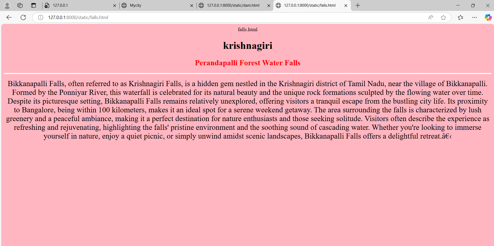
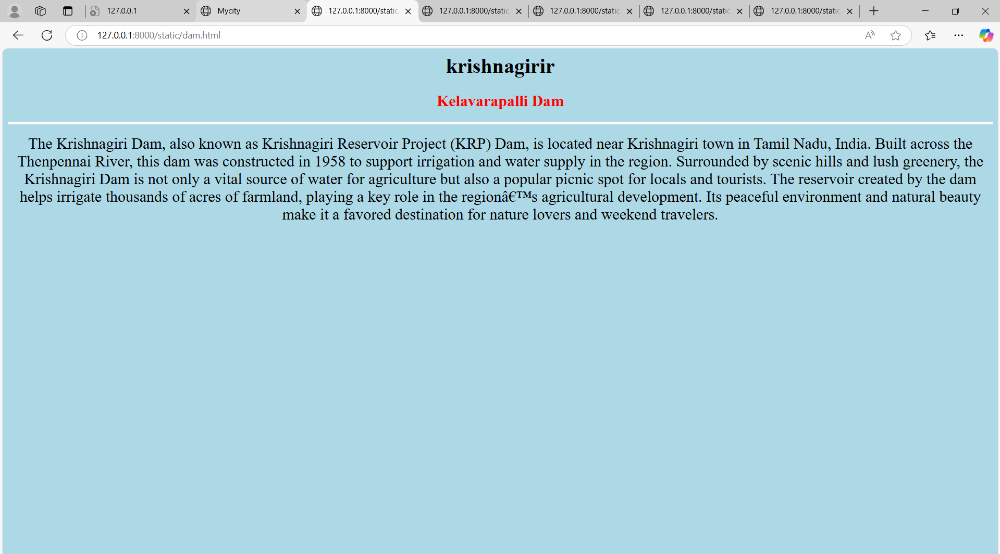
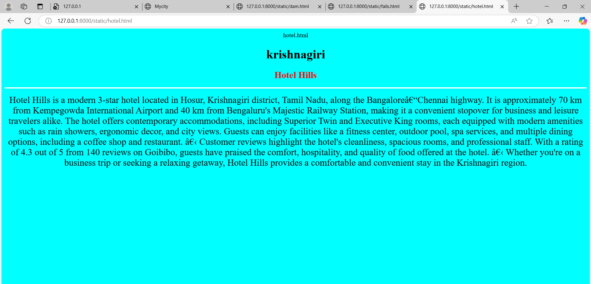
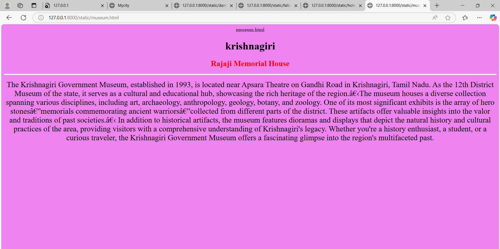
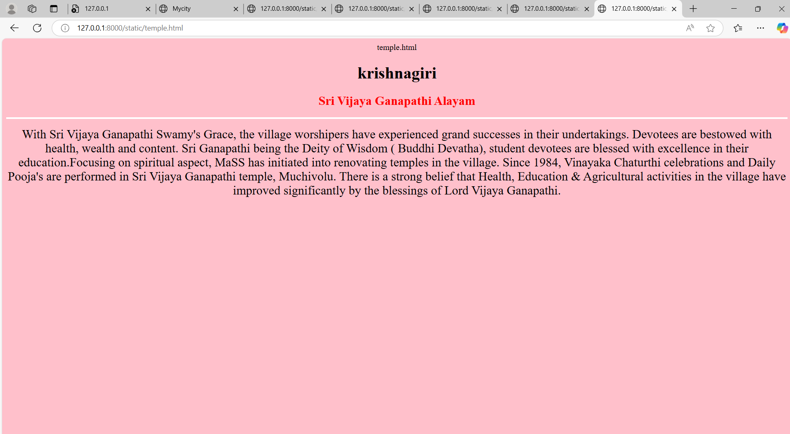

# Ex04 Places Around Me
## Date: 23.04.25

## AIM
To develop a website to display details about the places around my house.

## DESIGN STEPS

### STEP 1
Create a Django admin interface.

### STEP 2
Download your city map from Google.

### STEP 3
Using ```<map>``` tag name the map.

### STEP 4
Create clickable regions in the image using ```<area>``` tag.

### STEP 5
Write HTML programs for all the regions identified.

### STEP 6
Execute the programs and publish them.

## CODE
```
falls.html
<html>
    <h1 align="center">
        <font face="Times New Roman" color="black" size="6">krishnagiri</font>
    </h1>
    <h3 align="center">
        <font face="Times New Roman" color="red" size="5.5">Perandapalli Forest Water Falls</font>
    </h3>
    <body bgcolor="blue" align="center">
        <hr size="4" color="white">
        <p align="center">
        <font face="Times New Roman" size="5">
            Bikkanapalli Falls, often referred to as Krishnagiri Falls, is a hidden gem nestled in the Krishnagiri district of Tamil Nadu, near the village of Bikkanapalli. Formed by the Ponniyar River, this waterfall is celebrated for its natural beauty and the unique rock formations sculpted by the flowing water over time. Despite its picturesque setting, Bikkanapalli Falls remains relatively unexplored, offering visitors a tranquil escape from the bustling city life. Its proximity to Bangalore, being within 100 kilometers, makes it an ideal spot for a serene weekend getaway. The area surrounding the falls is characterized by lush greenery and a peaceful ambiance, making it a perfect destination for nature enthusiasts and those seeking solitude. Visitors often describe the experience as refreshing and rejuvenating, highlighting the falls' pristine environment and the soothing sound of cascading water. Whether you're looking to immerse yourself in nature, enjoy a quiet picnic, or simply unwind amidst scenic landscapes, Bikkanapalli Falls offers a delightful retreat.​
        </font>
        </p>
    </body>
</html>
```
```
dam.html
<html>
    <h1 align="center">
        <font face="Times New Roman" color="black" size="6">krishnagirir</font>
    </h1>
    <h3 align="center">
        <font face="Times New Roman" color="red" size="5.5">Kelavarapalli Dam</font>
    </h3>
    <body bgcolor="purple" align="center">
        <hr size="4" color="white">
        <p align="center">
        <font face="Times New Roman" size="5">
            The Krishnagiri Dam, also known as Krishnagiri Reservoir Project (KRP) Dam, is located near Krishnagiri town in Tamil Nadu, India. Built across the Thenpennai River, this dam was constructed in 1958 to support irrigation and water supply in the region. Surrounded by scenic hills and lush greenery, the Krishnagiri Dam is not only a vital source of water for agriculture but also a popular picnic spot for locals and tourists. The reservoir created by the dam helps irrigate thousands of acres of farmland, playing a key role in the region’s agricultural development. Its peaceful environment and natural beauty make it a favored destination for nature lovers and weekend travelers.
        </font>
        </p>
    </body>
</html>
```
```
hotel.html
<html>
    <h1 align="center">
        <font face="Times New Roman" color="black" size="6">krishnagiri</font>
    </h1>
    <h3 align="center">
        <font face="Times New Roman" color="red" size="5.5">Hotel Hills</font>
    </h3>
    <body bgcolor="cyan" align="center">
        <hr size="4" color="white">
        <p align="center">
        <font face="Times New Roman" size="5">
            Hotel Hills is a modern 3-star hotel located in Hosur, Krishnagiri district, Tamil Nadu, along the Bangalore–Chennai highway. It is approximately 70 km from Kempegowda International Airport and 40 km from Bengaluru's Majestic Railway Station, making it a convenient stopover for business and leisure travelers alike. 
            The hotel offers contemporary accommodations, including Superior Twin and Executive King rooms, each equipped with modern amenities such as rain showers, ergonomic decor, and city views. Guests can enjoy facilities like a fitness center, outdoor pool, spa services, and multiple dining options, including a coffee shop and restaurant. ​
            Customer reviews highlight the hotel's cleanliness, spacious rooms, and professional staff. With a rating of 4.3 out of 5 from 140 reviews on Goibibo, guests have praised the comfort, hospitality, and quality of food offered at the hotel. ​
            Whether you're on a business trip or seeking a relaxing getaway, Hotel Hills provides a comfortable and convenient stay in the Krishnagiri region.
        </font>
        </p>
    </body>
</html>
```
```
museum.html
<html>
    <h1 align="center">
        <font face="Times New Roman" color="black" size="6">krishnagiri</font>
    </h1>
    <h3 align="center">
        <font face="Times New Roman" color="red" size="5.5">Rajaji Memorial House</font>
    </h3>
    <body bgcolor="violet" align="center">
        <hr size="4" color="white">
        <p align="center">
        <font face="Times New Roman" size="5">
            The Krishnagiri Government Museum, established in 1993, is located near Apsara Theatre on Gandhi Road in Krishnagiri, Tamil Nadu. As the 12th District Museum of the state, it serves as a cultural and educational hub, showcasing the rich heritage of the region.​
            The museum houses a diverse collection spanning various disciplines, including art, archaeology, anthropology, geology, botany, and zoology. One of its most significant exhibits is the array of hero stones—memorials commemorating ancient warriors—collected from different parts of the district. These artifacts offer valuable insights into the valor and traditions of past societies.​
            In addition to historical artifacts, the museum features dioramas and displays that depict the natural history and cultural practices of the area, providing visitors with a comprehensive understanding of Krishnagiri's legacy. Whether you're a history enthusiast, a student, or a curious traveler, the Krishnagiri Government Museum offers a fascinating glimpse into the region's multifaceted past.
        </font>
        </p>
    </body>
</html>
```
```
temple.html
<html>
    <h1 align="center">
        <font face="Times New Roman" color="black" size="6">krishnagiri</font>
    </h1>
    <h3 align="center">
        <font face="Times New Roman" color="red" size="5.5">Sri Vijaya Ganapathi Alayam</font>
    </h3>
    <body bgcolor="pink" align="center">
        <hr size="4" color="white">
        <p align="center">
        <font face="Times New Roman" size="5">
            With Sri Vijaya Ganapathi Swamy's Grace, the village worshipers have experienced grand successes in their undertakings. Devotees are bestowed with health, wealth and content. Sri Ganapathi being the Deity of Wisdom ( Buddhi Devatha), student devotees are blessed with excellence in their education.Focusing on spiritual aspect, MaSS has initiated into renovating temples in the village. Since 1984, Vinayaka Chaturthi celebrations and Daily Pooja's are performed in Sri Vijaya Ganapathi temple, Muchivolu. There is a strong belief that Health, Education & Agricultural activities in the village have improved significantly by the blessings of Lord Vijaya Ganapathi.
        </font>
        </p>
    </body>
</html>
```
## OUTPUT









## RESULT
The program for implementing image maps using HTML is executed successfully.
